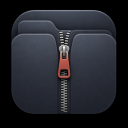
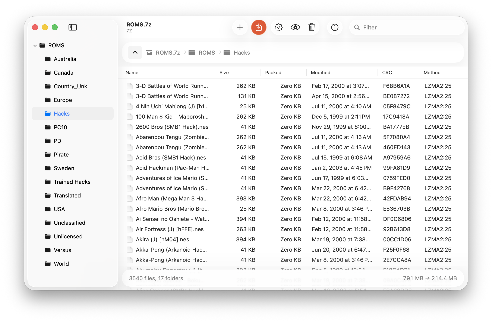
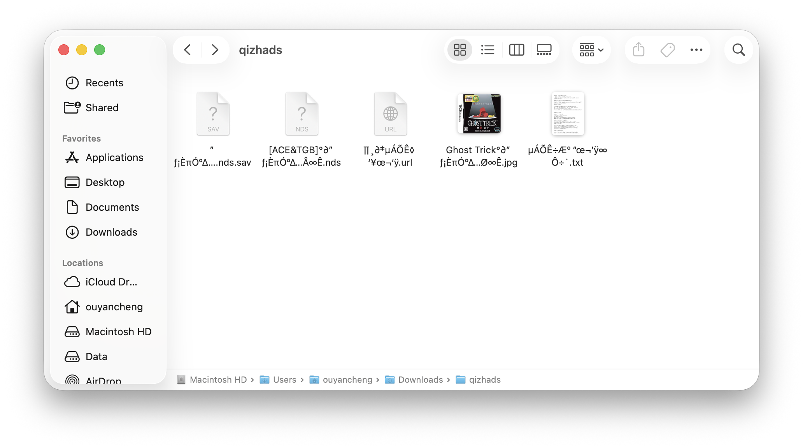
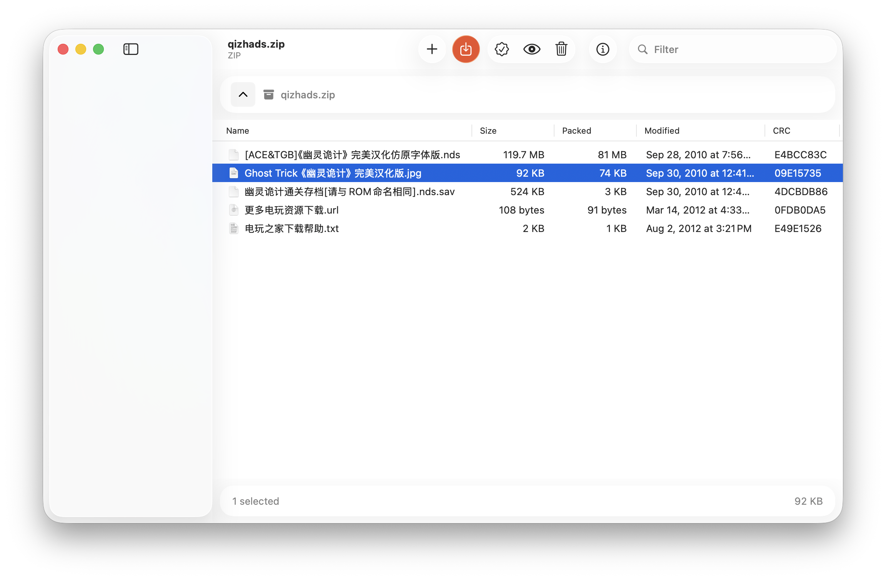
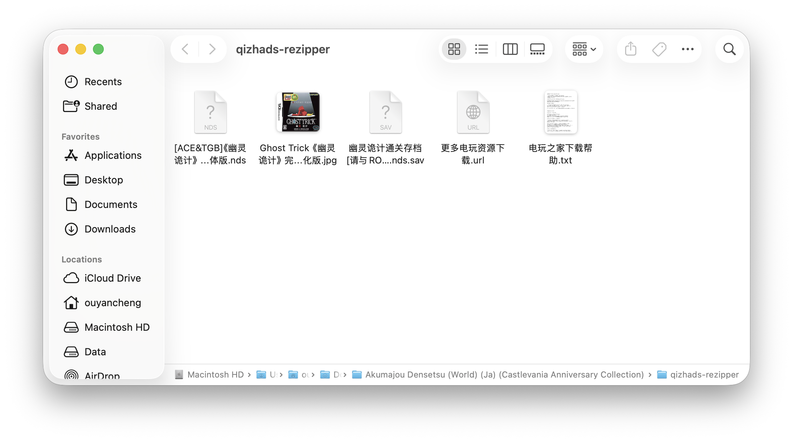

<p align="center">
  
</p>

<h1 align="center">ReZipper</h1>

<p align="center">
  <strong>A native macOS archiver for the official 7-Zip engine.</strong><br>
  WinRAR’s command layout. Finder’s manners. Tahoe’s Liquid Glass.
</p>

<p align="center">
  
  
  
  
</p>

<p align="center">
  
</p>

<p align="center"><em>3,540 NES ROMs in a 7z. Sidebar, breadcrumbs, CRC, LZMA2 — browsed like a folder on disk.</em></p>

---

## A real Mac window

ReZipper is AppKit all the way down — not a web view, not a cross-platform kit. Unified toolbar, source-list sidebar, glass path and status bars, and a terracotta Extract control that sits where the hand already is.

| | |
| --- | --- |
| **Toolbar** | Add, Extract, Test, Quick Look, Delete, Info, and a live Filter field |
| **Sidebar** | Folder tree for the archive, the way Finder does a volume |
| **List** | Name, Size, Packed, Modified, CRC, Method |
| **Path bar** | Jump to any ancestor without rebuilding the window |
| **Status** | File counts and `791 MB → 214.4 MB` at a glance |

---

## What it does

- Browse archives in a Finder-like split view
- Create `7z`, `zip`, `tar`, `gz`, `bz2`, `xz`, and `wim`
- Extract the whole archive, or just the selected file / folder — **without** replaying the parent path
- Add files and folders to writable archives
- Delete items, test integrity, Quick Look previews
- AES passwords, optional 7z header encryption, solid archives
- Drag files in to add; drag files out to extract

Read support includes those formats plus **RAR, ISO, CAB, DMG**, and the rest of 7-Zip’s handlers (read-only when 7-Zip cannot update the format).

---

## Filenames that stay Chinese

A lot of zips from Windows — especially Chinese ones — store names in **GBK** and never set the ZIP UTF-8 flag. Most macOS unarchivers then treat those bytes as Mac Roman or UTF-8. The list looks fine until you extract; the files on disk become mojibake.

ReZipper reads the raw central-directory names, sniffs GBK / Shift-JIS / Big5 / EUC-KR, and uses the decoded names for **both** preview and extract.

`qizhads.zip` is the usual case: no UTF-8 flag, GBK payload.

<table>
  <tr>
    <td width="50%" valign="top">
      <p align="center"><strong>Another unarchiver</strong></p>
      
      <p align="center"><em>Extracted names nobody can read.</em></p>
    </td>
    <td width="50%" valign="top">
      <p align="center"><strong>ReZipper</strong></p>
      
      <p align="center"><em>The archive, as it was meant to be read.</em></p>
    </td>
  </tr>
</table>

<p align="center">
  
</p>

<p align="center"><em>Same zip, extracted by ReZipper. Finder shows 《幽灵诡计》, not <code>°∂”ƒ¡ÈπÓ</code>.</em></p>

| Other tools write | ReZipper writes |
| --- | --- |
| `Ghost Trick°∂”ƒ¡ÈπÓ°∆…Ø∞Ê.jpg` | `Ghost Trick《幽灵诡计》完美汉化版.jpg` |
| `„ƒ¡ÈπÓ°∆….nds.sav` | `幽灵诡计通关存档[请与ROM命名相同].nds.sav` |
| `[ACE&TGB]°∂”ƒ¡ÈπÓ°∆…Â∞Ê.nds` | `[ACE&TGB]《幽灵诡计》完美汉化仿原字体版.nds` |
| `µÄÕÊ÷ÆÆ° “œ¬˜‘ÿ∞Ô÷˙.txt` | `电玩之家下载帮助.txt` |
| `∏‚∂‡µÄÕÊ◊ˇ￥œ¬˜‘ÿ.url` | `更多电玩资源下载.url` |

---

## Architecture

```
AppKit (Objective-C++)  →  ArchiveEngine (C++)  →  bit7z  →  7z.so (Format7zF)
```

`7z.so` is the official **7-Zip 26.02** shared library, built from `ThirdParty/7zip` and loaded from `ReZipper.app/Contents/Frameworks/7z.so`. The UI never reimplements compression; it talks to Igor Pavlov’s engine.

---

## Build

Needs macOS 12+, CMake 3.22+, Ninja or Make, and Apple Clang. Xcode Command Line Tools are enough.

```bash
cmake -S . -B build -G Ninja -DCMAKE_BUILD_TYPE=Release
cmake --build build
open build/ReZipper.app
```

The first build compiles Format7zF (a few minutes) and bit7z, then the app.

```bash
# same engine the app uses
build/rezipper-cli --lib build/ReZipper.app/Contents/Frameworks/7z.so \
  list ~/Downloads/qizhads.zip
```

---

## License

ReZipper’s own code is **MIT**. The bundled 7-Zip engine is **LGPL 2.1+** with
the unRAR restriction; bit7z is **MPL 2.0**. See [LICENSE.md](LICENSE.md).
